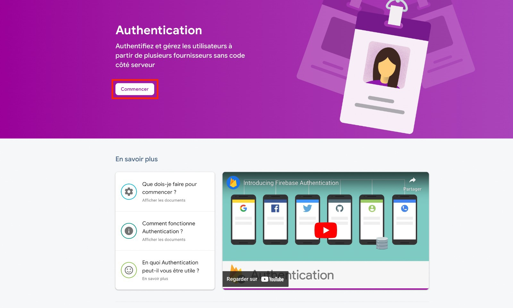
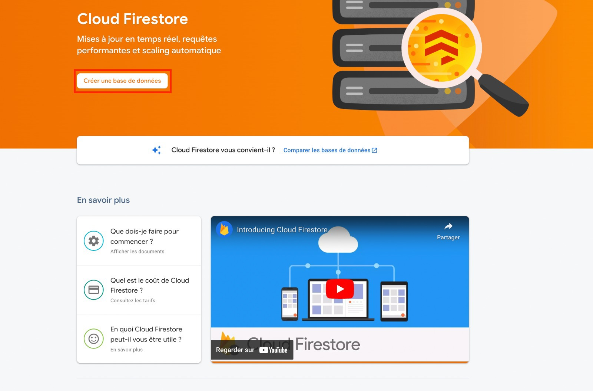
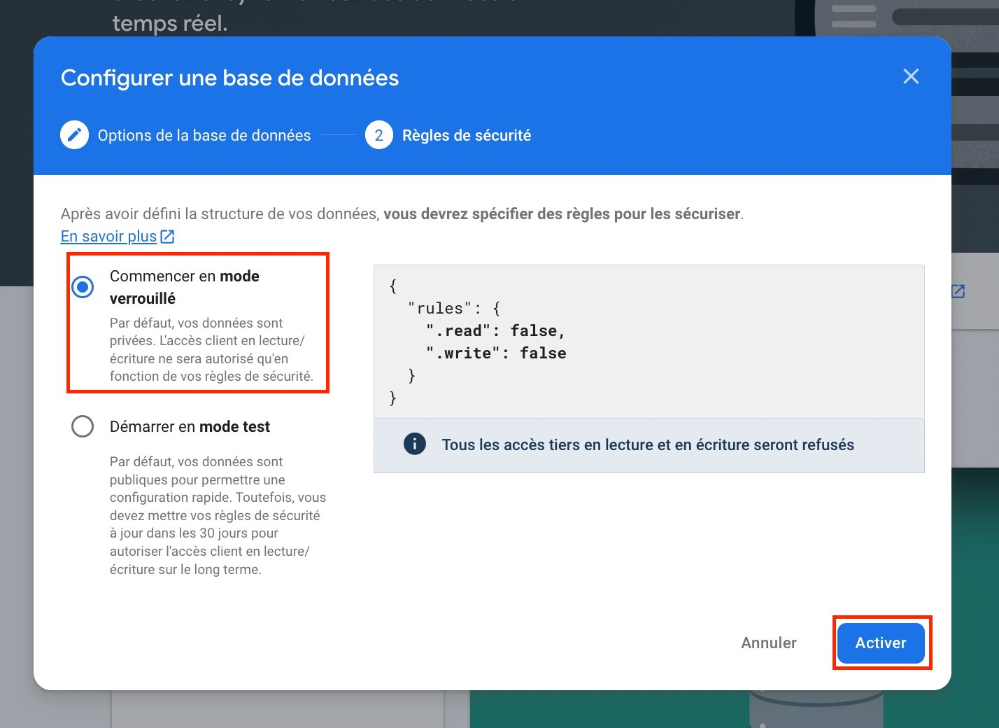
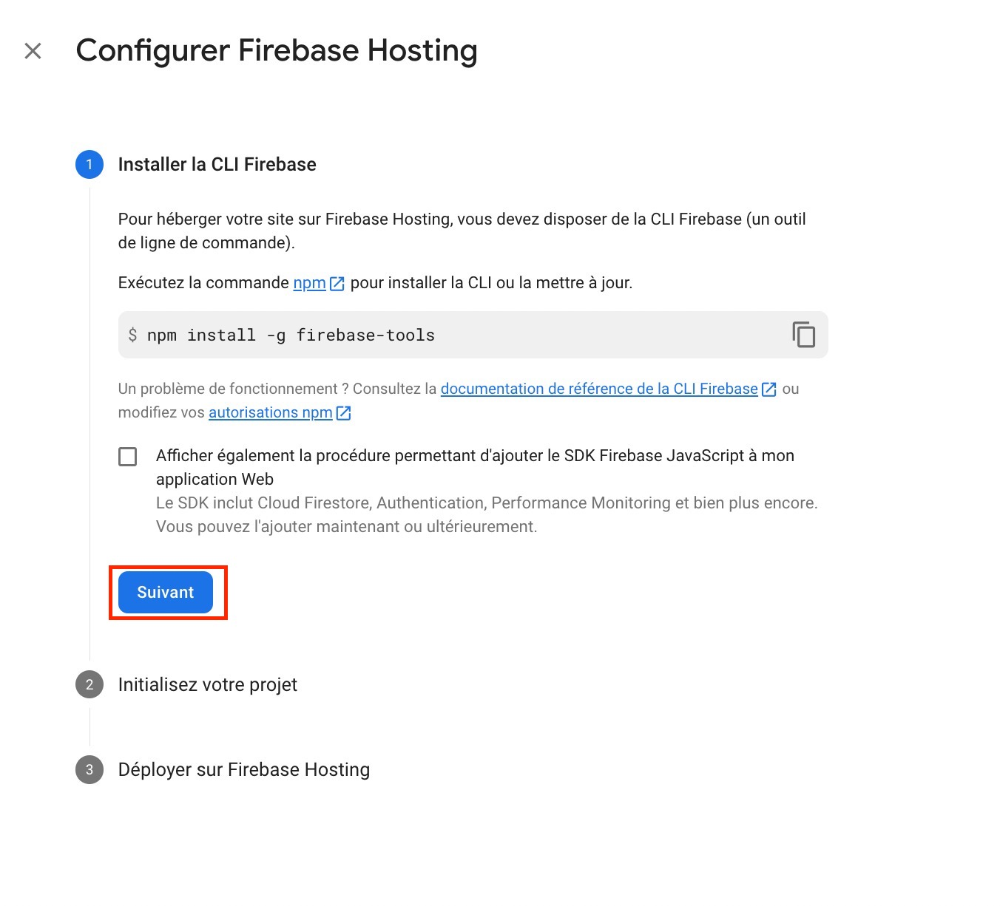
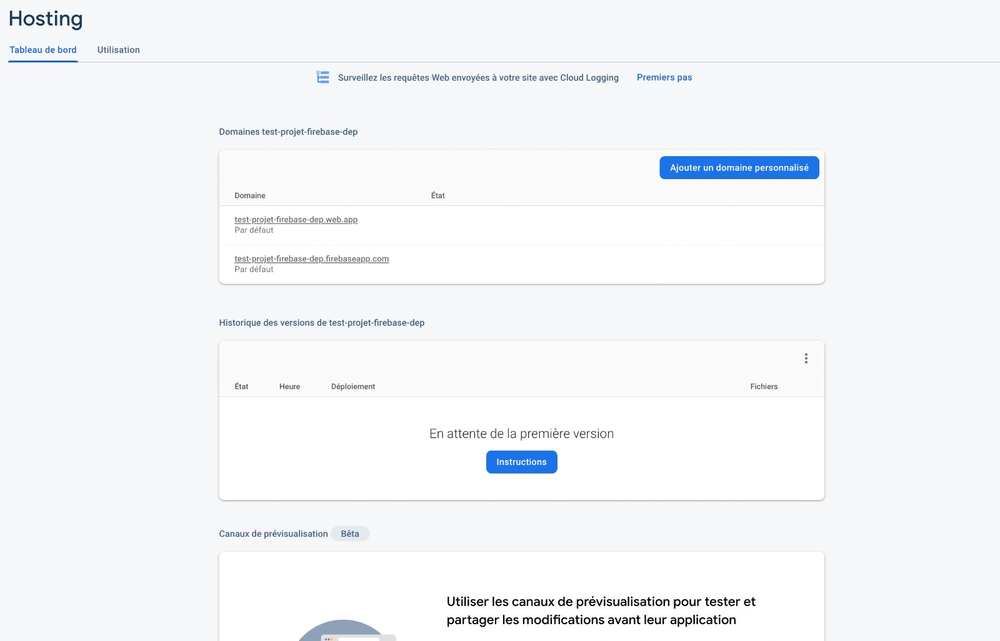
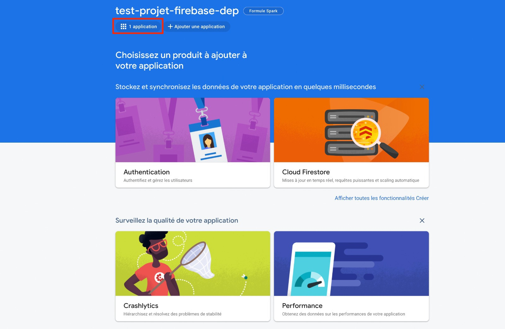
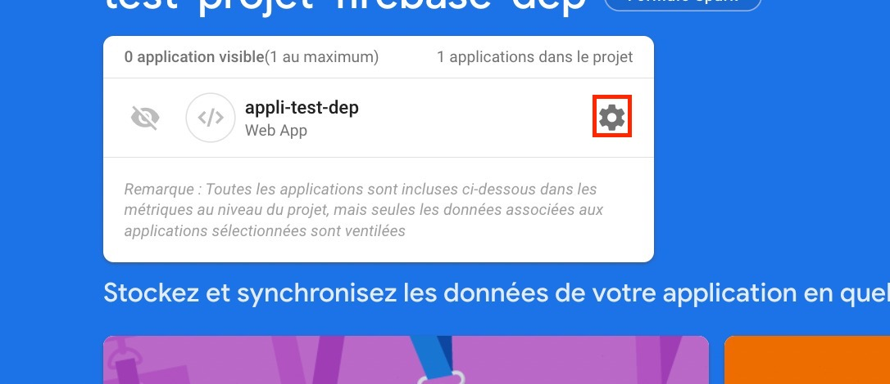

E# Deploiement Read Me
## Configuration Firebase

Aller sur https://firebase.google.com/

Si vous n'avez pas de compte, créer en un, puis connectez vous.

Aller dans la console firebase via l'invite suivante:

Vous arrivez sur la page des projets.

### Création du projet
Creez un nouveau projet 

1. Donner un nom au projet
2. Decider de l'utilisation de Google Analytics (Optionnel pour le projet) 
3. Valider

Après validation votre projet est créer et prêt pour utilisation. Cliquer sur continuer. Firebase ouvre par defaut votre projet.

### Création de l'application WEB

1. Creer une application via le bouton

2. Donner un nom à l'application (Exp : appli-test), et enregistrer l'applicaion

Firebase vous propose d'ajouter le SDK firabase (ajouter Firebase à votre application). Ce qui vous interesse c'est la configuration firebase.

Acceder à la console via le bouton proposé.

### Installation des dépendances

Acceder à toutes les dépendances via le bouton acceder à tous les produits 

Ensuite installer les produits encadrés qui sont : 

#### Authentication

Cliquer sur commencer

Il vous est proposé un ensemble de moyen de conncetion, nous vous recommandons d'utiliser google comme sur l'image 009;
Configurer google:

1. Activer l'option
2. Configurer une adresse d'assistance
3. Valider 

Si tout se passe bien vous devez avoir ce résultat

#### Cloud Firestore

Cliquer sur créer une base de données

Sur la page de configuration, sélectionner le mode production puis cliquer sur suivant.

Ensuite sélectionner l'emplacement de stockage de vos données (014) puis activer la base de données.

Si tout se passe bien vous devez avoir ce résultat 

#### Realtime database

Cliquer sur créer une base de données

Sélectionner l'emplacement de stockage de vos données puis cliquer sur suivant

Selectionner le mode vérrouillé puis cliquer sur Activer

Si tout se passe bien dous devez avoir ce résultat

#### Hosting

Cliquer sur Commencer

Les étapes suivantes vous indique la marche à suivre afin de pouvoir déployer votre application, les ligne de commande seront à executer pas à pas

A l'étape 3 cliquer sur acceder à la console

Si tout se passe bien vous devez avoir ce résultat 

## Configuration du Client UI

### Télécharger les sources du projet

### Accès à la configuration Firebase

Dépuis la console firebase, ouvrez votre projet

Acceder à l'application  via le raccourcie

Acceder aux paramètres de l'application depuis le raccourcie

Une fois dans la paramètres 

scroller vers le bas jusqu'a la section Firebase config

## Vérification des installations
