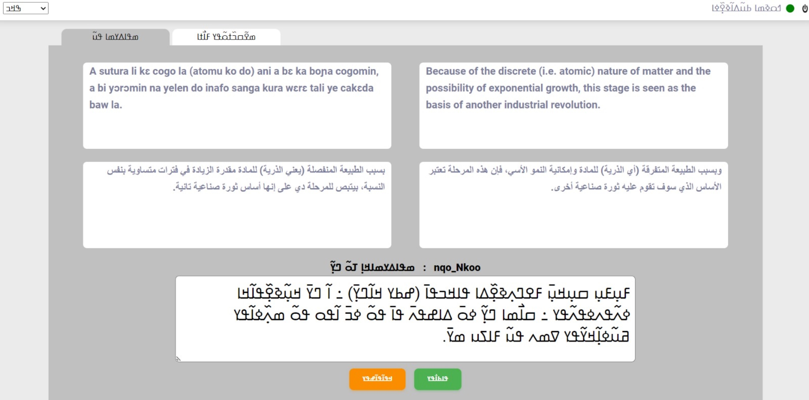
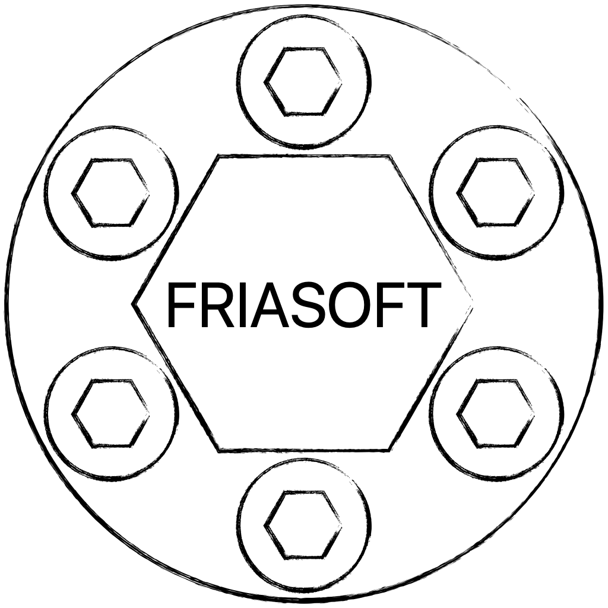

# Fria||el: Parallel text curation software system


Fria||el  is a collaborative parallel text curation software system that tracks individual segments through a translation and copyedit workflow. Each segment is translated by one translator, and subsequently sequentially copyedited by other translators. Fria||el allows translators to simultaneously inspect variants of the source segment in multiple languages. This results in segments translated and copyedited in the context of different subsets of source languages.
In addition to the final parallel corpus, Fria||el also yields copyedit logs, which could be valuable in various modeling scenarios.


# ℹ️ Documentation
- Deploy Friallel
    - Create firebase project and deploy web application [English](docs/001_webui_firebase.eng.md) [French](docs/001_webui_firebase.fra.md)
    - Deploy firebase indices [TODO]()
    - Deploy firebase functions [TODO]()
    - Adjust firebase security rules [TODO]()
    - Setup translator accounts [TODO]()
- Use Friallel to extend a multilingual parallel corpus
    - Import parallel corpus [TODO]()
    - Create workflows [TODO]()
    - Export accounting reports [TODO]()
    - Export parallel corpus [TODO]()
- More information in this paper: https://arxiv.org/pdf/2310.15612.pdf


## Cite this work
```
@article{doumbouya2023machine,
  title={Machine Translation for Nko: Tools, Corpora and Baseline Results},
  author={Doumbouya, Moussa Koulako Bala and Dian{\'e}, Baba Mamadi and Ciss{\'e}, Solo Farabado and Dian{\'e}, Djibrila and Sow, Abdoulaye and Doumbouya, S{\'e}r{\'e} Moussa and Bangoura, Daouda and Bayo, Fod{\'e} Moriba and Cond{\'e}, Ibrahima Sory and Dian{\'e}, Kalo Mory and others},
  journal={arXiv preprint arXiv:2310.15612},
  year={2023}
}
```

## Ackowledgement
<table style="text-align: center;">
  <tr>
    <td>
      
    </td>
    <td>
      
    </td>
    <td>
      
    </td>
    <td>
      
    </td>
  </tr>
  <tr>
    <td>
      N'ko ߒߞߏ USA
    </td>
    <td>
      FriaSoft
    </td>
    <td>
      Meta Platforms, Inc.
    </td>
    <td>
      Stanford University
    </td>
  </tr>
</table>


## License
[MIT](LICENSE)
