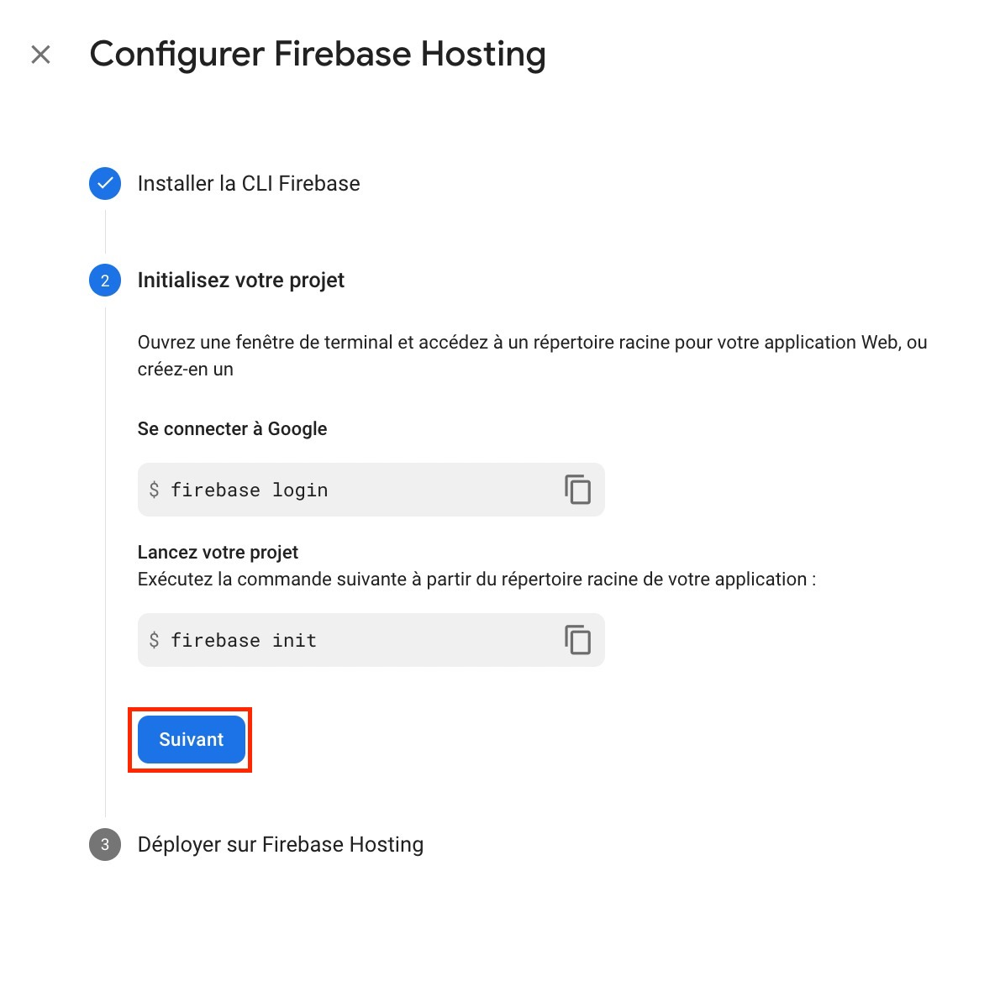
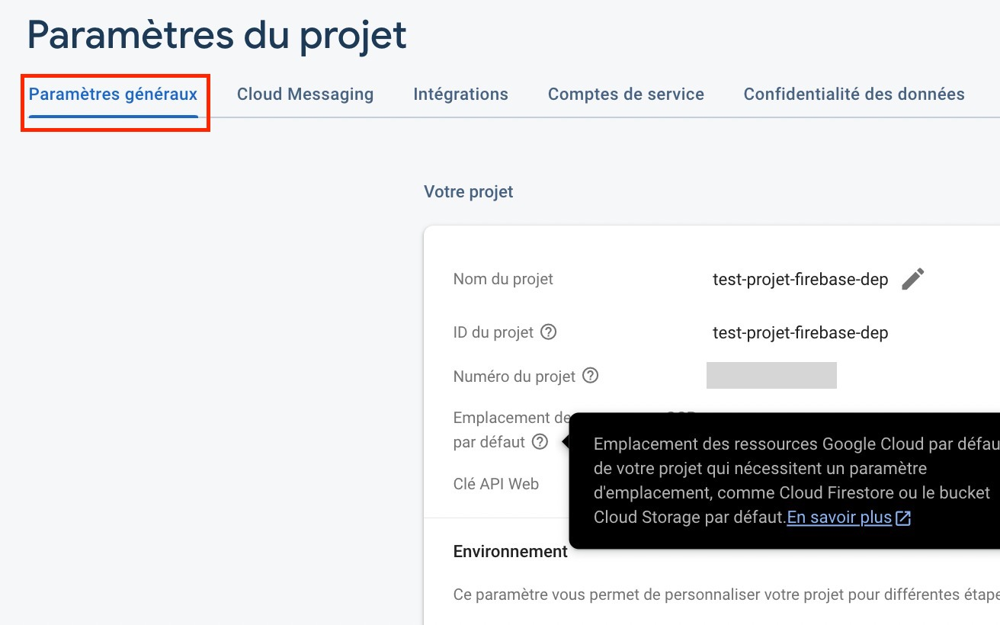

E# Deploiement Read Me
## Configuration Firebase

Aller sur https://firebase.google.com/

Si vous n'avez pas de compte, créer en un, puis connectez vous.

Aller dans la console firebase via l'invite suivante:

Vous arrivez sur la page des projets.

### Création du projet
Creez un nouveau projet 

1. Donner un nom au projet
2. Decider de l'utilisation de Google Analytics (Optionnel pour le projet) 
3. Valider

Après validation votre projet est créer et prêt pour utilisation. Cliquer sur continuer. Firebase ouvre par defaut votre projet.

### Création de l'application WEB

1. Creer une application via le bouton

2. Donner un nom à l'application (Exp : appli-test), et enregistrer l'applicaion

Firebase vous propose d'ajouter le SDK firabase (ajouter Firebase à votre application). Ce qui vous interesse c'est la configuration firebase.

Acceder à la console via le bouton proposé.

### Installation des dépendances

Acceder à toutes les dépendances via le bouton acceder à tous les produits 

Ensuite installer les produits encadrés qui sont : 

#### Authentication

Cliquer sur commencer

Il vous est proposé un ensemble de moyen de conncetion, nous vous recommandons d'utiliser google comme sur l'image 009;
Configurer google:

1. Activer l'option
2. Configurer une adresse d'assistance
3. Valider 

Si tout se passe bien vous devez avoir ce résultat

#### Cloud Firestore

Cliquer sur créer une base de données

Sur la page de configuration, sélectionner le mode production puis cliquer sur suivant.

Ensuite sélectionner l'emplacement de stockage de vos données (014) puis activer la base de données.

Si tout se passe bien vous devez avoir ce résultat 

#### Realtime database

Cliquer sur créer une base de données

Sélectionner l'emplacement de stockage de vos données puis cliquer sur suivant

Selectionner le mode vérrouillé puis cliquer sur Activer

Si tout se passe bien dous devez avoir ce résultat

#### Hosting

Cliquer sur Commencer

Les étapes suivantes vous indique la marche à suivre afin de pouvoir déployer votre application, les ligne de commande seront à executer pas à pas

A l'étape 3 cliquer sur acceder à la console

Si tout se passe bien vous devez avoir ce résultat 

## Configuration du Client UI

### Télécharger les sources du projet

### Accès à la configuration Firebase

Dépuis la console firebase, ouvrez votre projet

Acceder à l'application  via le raccourcie

Acceder aux paramètres de l'application depuis le raccourci

Une fois dans la paramètres 

scroller vers le bas jusqu'a la section Firebase config

## Vérification des installations

__________________________

## Envionrment de Dev et des sources 
### Installer les outils necessaires
- Télécharger et installer VSCode : https://code.visualstudio.com/
- Télécharger et installer NodeJS (version ???) : https://nodejs.org/en/download
- Installer Git : https://git-scm.com/book/en/v2/Getting-Started-Installing-Git
- Configurer Git avec vos informations d'authentification 
- Télécharger et installer Python (version 3.10): 

### Recuperer et installer les sources  
Configurer l'espace de travail sur votre ordinateur

Se connecter sur Githut, utiliser le lien courant: "Missing Link"
Telecharger les sources sur le repertoire de travail: git clone "Missing link"

Ouvrir le repertoire du project dans VSCode et importer le projet

Installer les librairies de Python : 

Installer les dependances : npm install

Configurer le projet local au projet Firebase créé préalablement

Télécharger et installer la clé du projet Firebase (Ajouter une image)

### Description des sources installées
Le projet installé est divisé en 4 grands groupes:
1.  Data: localisé dans le dossier "data/" à la racine du projet, data contient les données (datasets) à charger en base de données. On y restrouve des données pour: Flores-Dev, NLLB, NTREX 
2. Scrips Python: localisé dans le dossier "scripts/" à la racine du projet, les scripts (Python) sert à transformer les datasets pour les charger en base dans la Firestore. Les scripts permettent aussi d'exporter les données et de genérer des rapports d'avancement sur les taches.
3. Projet UI: localisé dans le dossier "data/" depuis la racine du projet, il s'agit de l'application front qui permet à l'utilisateur (traducteur ou verificateur) de se connecter et d'effecter ces taches en fonction de leur roles. Cette aplication sera hébergé directement sur Firebase
4. Fonctions: localisé dans le dossier "./project-annotation-web-ui/functions" depuis la racine du projet
5. La base de données: déployé grace à la firestore, sa création initiale ne require aucune entrée d'enregistrement. Les données sont enregistrées progressivement grace l'upload des datasets, l'activité des utilisateurs sur l'interface web, ainsi que les fonctions cloud qui tournent en background.

## Deploiement sur l'environnement
### Context
Le deploiement des differents composants de l'application requiert un ordre precis et des prerequis.

Les pré-requis sont : 
- La ou les dataset(s): le dictionnaire de données à inserer 
- La clé token du projet firebase telechargé: utilisé par les scripts Python pour preparer et integrer les datasets à la Firestore. Elle est declarée dans le code comme suit : 
#
	key_name = "keys/fbServiceAccountKey-" + env + ".json" (env = "dev" or "prod")
#

#### Les étapes suivantes seront à effectuer dans un terminal. 

### 1. Preparation et chargement des données
La preparation des données peut etre une etape obligatoire en fonction de la structure de la dataset à intégrer. Cette application a été developpé en utilisant la structure de la dataset de flores : 
- un dossier contenant un sous dossier avec les fichers contenant les phrase par langue

Etant donné qu'il va falloir utiliser les scripts python

#### 1.1. Chargement des données 
Nous allons utiliser les scripts python pour l'insertion, il faut se mettre à la racine du projet : 
#
	- Syntaxe: python scripts/load_dataset.py --env "ENV_NAMLE" --dataset-root-dir "DATASET_FILES_PATH"  --dataset-name "DATASET_NAME" --batch-size "BATCH_SIZE"
	- Example: python scripts/load_dataset.py --env dev 	--dataset-root-dir data/flores200_dataset/dev  --dataset-name flores-dev -- batch-size 100
#

BATCH_SIZE correspond pour au nombre de transactions à faire en meme temps. Ceci permet de reduire la durée d'exécution, mais il faut que ça soit inférieure ou égale à 100.

#### 1.2. Preparation des données: 
Les datasets NTREX et NLLB ont necessité un réalignment avec la structure la dataset flores avant d'inserer la dataset dans la firestore. Il faut s'assurer que les commandes python sont activés dans le terminal.
#
	Pour Windows: .venv3.10.4\Scripts\activate
#

Pour NLLB, la préparation des données exigent d'executer les lignes générées par le script ci-dessous: 

# 
	generate-nllb-alignment-command-lines:
	for l in data/NLLB-Seed/* ; do \
		echo "python scripts/match_file_lines.py data/Multitext-NLLB-Seed/eng_Latn $${l}/eng_Latn --output-files data/Multitext-NLLB-Seed/order_files/reference_`basename $$l`.order.txt data/Multitext-NLLB-Seed/order_files/`basename $$l`.order.txt"; \
		for lang_file in $$l/* ; do \
			echo "python scripts/sort_file.py --input-file $${lang_file} --order-file data/Multitext-NLLB-Seed/order_files/`basename $$l`.order.txt --output-file data/Multitext-NLLB-Seed/re_ordered/`basename $$l`/`basename $$lang_file`"; \
		done; \
	done; \
#
Pour NTREX, il faut créer un fichier de mapping et exécuter la commande suivante:
# 
	- Syntaxe: python scripts/preprocess-ntrex-128.py --input-dir "CHEMIN_FICHIERS_DONNEES" --mapping-file "FICHIER_MAPPING" --output-dir "REPORTOIRE_EXPORT_DONNEES"
	- python scripts/preprocess-ntrex-128.py --input-dir data/NTREX-128/ --mapping-file data/NTREX-128/mapping/mapping-file.csv --output-dir data/NTREX-128/preprocessed
#

### 2. Mise à jour des indexes et regles Firebase
La prochaine étape d'installation consiste à deployer les régles de securité et les index de la firestore. 

Avant tout, il faut se mettre dans le repertoire où se trouve "firebase.json " et se connecter à l'environnement:
#
	- Synthaxe: firebase use "env_name"
	- Exemple: firebase use dev
#

Pour installer les régles et index:
#
	- Regles de sécurité: firebase deploy --only firestore:rules
	- Index: firebase deploy --only firestore:indexes
#

### 3. Deploiment des fonctions
Ensuite, il faut installer les fonctions et pour le faire, il faut utiliser la commande suivante :
#
	Synthaxe: 	firebase deploy --only functions
#
### 4. Deploiment de l'application 
La dernière étape consiste à deployer l'application web. Pour le faire, il faut mettre à jour le fuchier d'environnement "environnement.js" et utiliser la commande suivante:

#
	- Synthaxe: firebase deploy --only hosting 
#

## Informations utiles 

Quelques commandes qui peuvent servir : 

#
	- Start firebase emulartor : firebase emulators:start 
	- Install Python packages : pip install -r requirements.txt
	- Export firebase indexes : firebase firestore:indexes 
#
