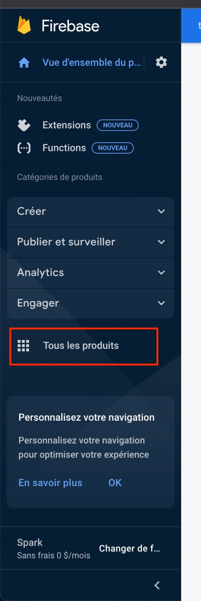
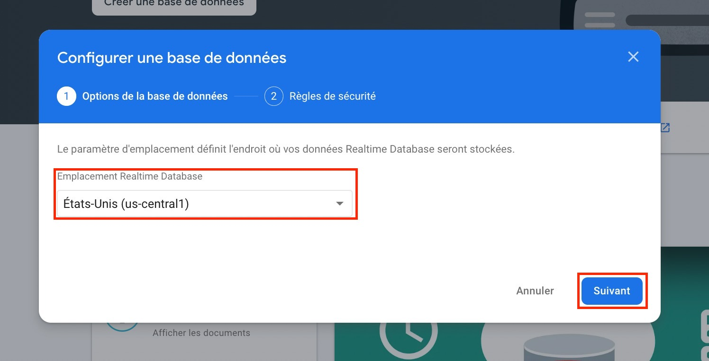
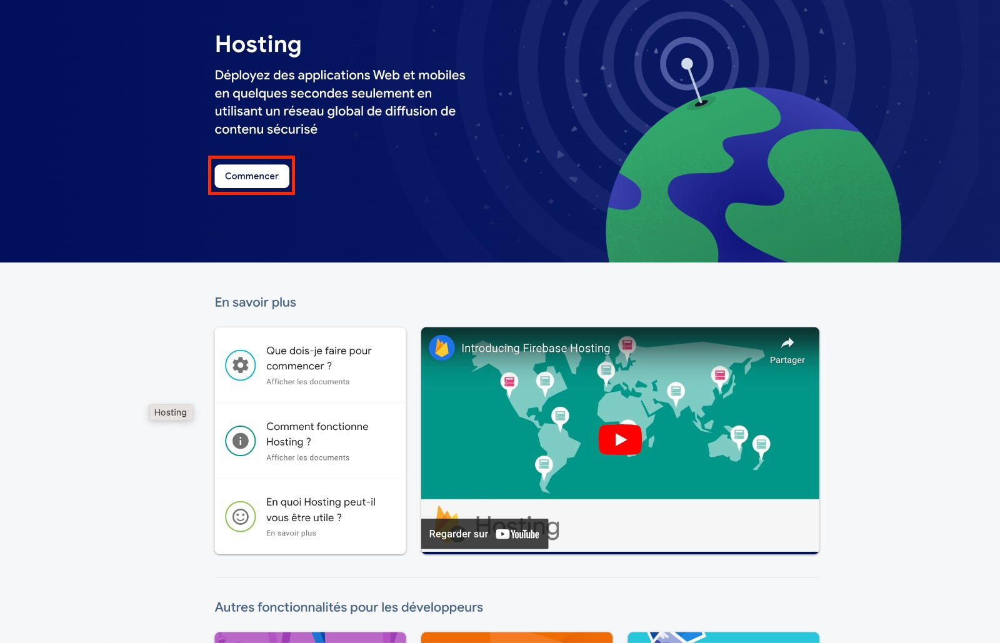

E# Deploiement Read Me
## Firebase Configuration

Go to https://firebase.google.com/

If you do not have a google account, please registrer, and then sign in.

Go to Firebase console using the following instructions:

This will take you to the project dashboard.

### Firebase Project Setup
Create a new project 

1. Name your project
2. Decide whether you would like to use Google Analytics (Not required for this project) 
3. Submit

After the submition, your project will be create and ready to use. Then click on continue, Firebase will open your project by default.

### Web Application creation

1. Create a web application using the button below

2. Name the new application (e.g.: appli-test), and save it.

Firebase will offer to add their SDK (add it to your app). What you need here is firebase configuration.

Go to the console using the button below.

### Installer Firebase Products

You can access other Firebase products using the button "All products". 

Then install the listed products below:
- Authentication
- Cloud Firestore
- Realtime Database
- Hosting
- Functions

#### Authentication

Click on the start button

You will be proposed a different type of authentication methods, you will have to use Google for this application - See the image below:

Configure Google:

1. Enable Google feature
2. Configure an email address for support
3. Submit

After submition, you should see the following result (see image)

#### Cloud Firestore

Click on create a new database 

Next select the type of use you have for this database, Production or Test:

Then select the data storage location (014) and start the database

After submition, you should see the following result (see image)

#### Realtime database

Cliquer sur créer une base de données

Sélectionner l'emplacement de stockage de vos données puis cliquer sur suivant

Selectionner le mode vérrouillé puis cliquer sur Activer

Si tout se passe bien dous devez avoir ce résultat

#### Hosting

Cliquer sur Commencer

Les étapes suivantes vous indique la marche à suivre afin de pouvoir déployer votre application, les ligne de commande seront à executer pas à pas

A l'étape 3 cliquer sur acceder à la console

Si tout se passe bien vous devez avoir ce résultat 

## Configuration du Client UI

### Télécharger les sources du projet

### Accès à la configuration Firebase

Dépuis la console firebase, ouvrez votre projet

Acceder à l'application  via le raccourcie

Acceder aux paramètres de l'application depuis le raccourci

Une fois dans la paramètres 

scroller vers le bas jusqu'a la section Firebase config

## Vérification des installations
